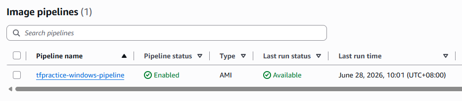
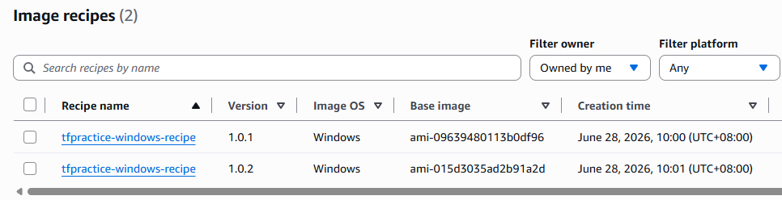
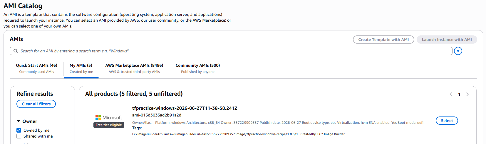
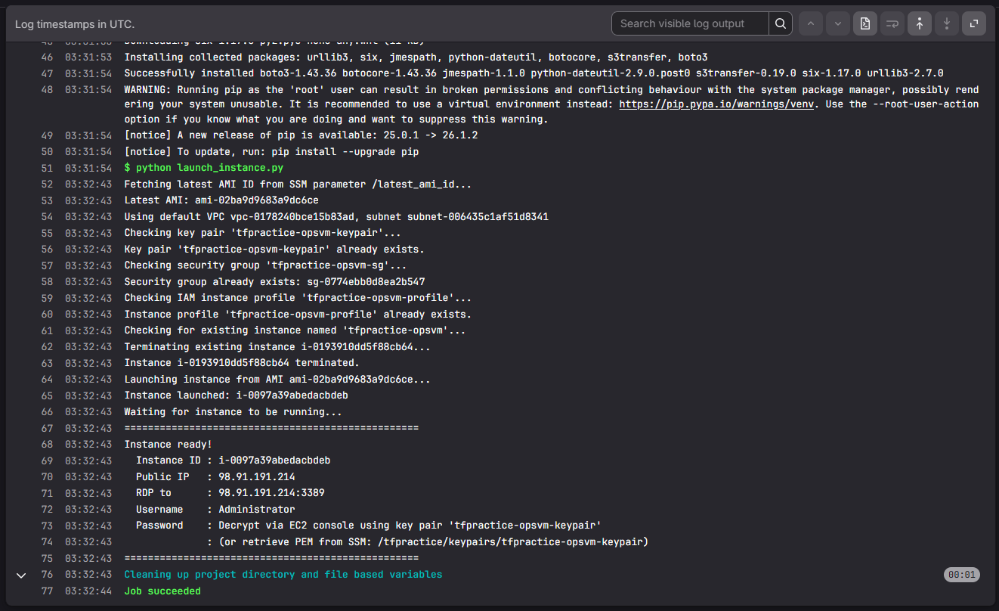
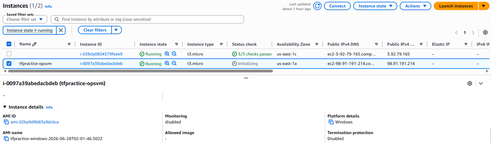
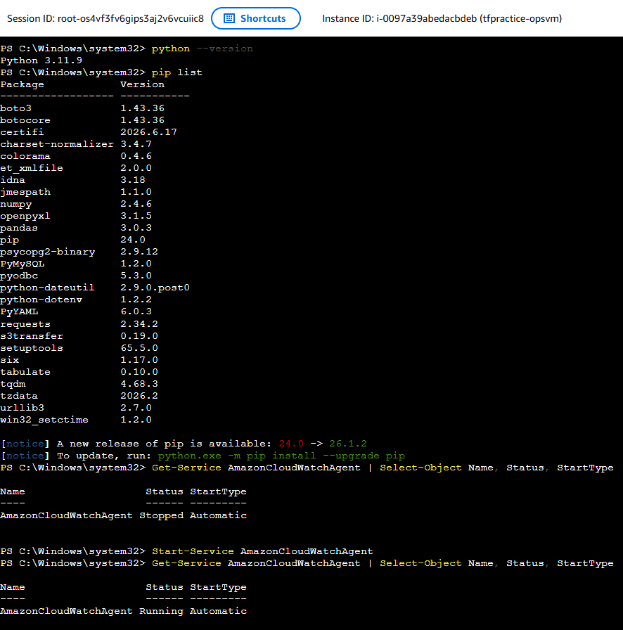
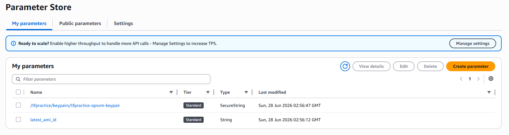

# auto-ec2-image-builder

This pipeline automates building patched Windows AMIs using EC2 Image Builder. Each successful build becomes the parent image for the next run, so patches accumulate over time without starting from scratch.

## How It Works

**Terraform** owns everything that rarely changes — the VPC, IAM roles, Image Builder components, the initial recipe, and the pipeline itself. Run it once to get the skeleton in place, then leave it alone.

**GitLab CI** handles the per-run work. Every time you trigger a build, the orchestrator script queries AWS for the current recipe version, bumps it, creates a new recipe pointing at the latest AMI, kicks off the pipeline, and streams the CloudWatch logs right into the job output while it waits. Once the build finishes, it writes the new AMI ID back to SSM so the next run picks up from there.

The key thing that makes this work cleanly: `parent_image` on the recipe and `image_recipe_arn` on the pipeline are both marked `ignore_changes` in Terraform, so GitLab can mutate them each run without Terraform trying to roll them back.

Recipe versions are bumped by querying what actually exists in AWS (not from a GitLab pipeline counter), so the version numbers in AWS and in the orchestrator stay in sync even if a run fails halfway through.

```
Terraform (terraform/)
  ├── networking.tf   — dedicated VPC, public subnet, outbound-only SG
  ├── iam.tf          — build instance role + instance profile
  └── main.tf         — components, initial recipe, pipeline, SSM seed

GitLab CI (.gitlab-ci.yml)
  ├── Upload-Installers         — fetches Python, CW Agent MSI, and Python wheels; syncs to S3
  ├── Trigger-Image-Pipeline    — bumps recipe version, triggers build, polls + streams logs
  └── Launch-Instance           — spins up an instance from the latest AMI (manual trigger)
```

## Repository Structure

```
.
├── .gitlab-ci.yml
├── requirements.txt
├── image_pipeline_orchestrator.py
├── launch_instance.py
├── terraform/
│   ├── main.tf            # Image Builder resources + SSM seed parameter
│   ├── networking.tf      # VPC, subnet, IGW, route table, SG
│   ├── iam.tf             # Build instance role + instance profile
│   ├── outputs.tf         # Resource names + networking/IAM IDs
│   ├── variables.tf
│   └── terraform.tfvars   # initial_parent_image_ami = "ami-..."
├── components/
│   ├── install_cw_config_window.yml
│   ├── install_window_package.yml
│   └── update_wins_os.yml
└── screenshots/
    ├── pipeline-status.png
    ├── image-recipes.png
    ├── ami-catalog.png
    ├── ssm-parameters.png
    ├── ec2-instances.png
    ├── gitlab-launch-job.png
    └── powershell-verify.png
```

## AMI Components

Components run in this order (order matters — the Windows Update component triggers a reboot and must go last):

| Component | What it does |
|---|---|
| `install_cw_config_window.yml` | Downloads the CW Agent MSI from S3 and installs it. Writes a baked-in agent config to `ProgramData`, loads it, and sets the service to auto-start on boot. |
| `install_window_package.yml` | Installs AWS CLI v2 from the internet. Downloads Python 3.11.9 from S3 and installs it system-wide with PATH prepended. Downloads pre-built Python wheels from S3 and installs them offline via pip. |
| `update_wins_os.yml` | Installs PSWindowsUpdate, applies all pending Microsoft updates, reboots (Image Builder resumes automatically after), then checks no further reboot is needed. **Must be last.** |

### Python libraries bundled (offline wheels, Python 3.11 / win_amd64)

`boto3`, `botocore`, `pyodbc`, `psycopg2-binary`, `pymysql`,
`requests`, `urllib3`, `pandas`, `openpyxl`, `python-dotenv`, `pyyaml`,
`tqdm`, `tabulate`, `colorama`, `tzdata`, `win32-setctime`

These are just some sample libraries added to the baked AMI; it can be customized in the script to include additional dependencies as per operational requirements.

### CloudWatch Agent config

The config baked in by `install_cw_config_window.yml`:

| Type | Source | Destination |
|---|---|---|
| Log | Windows System events (CRITICAL, ERROR, WARNING) | `/tfpractice/opsvm/system` |
| Log | Windows Application events (CRITICAL, ERROR) | `/tfpractice/opsvm/application` |
| Metric | CPU idle + user | `TfpracticeOpsVM` namespace |
| Metric | Disk used % | `TfpracticeOpsVM` namespace |
| Metric | Memory used % | `TfpracticeOpsVM` namespace |

When `launch_instance.py` launches a new instance, it also passes UserData that re-runs `fetch-config` against `CW_SSM_CONFIG_PATH` (default `/tfpractice/opsvm/cw-agent-config`). This lets you update the live config via SSM without rebuilding the AMI.

## Networking

Terraform creates a small dedicated VPC for the Image Builder build instance so it doesn't depend on or interfere with any other networking:

| Resource | Value | Notes |
|---|---|---|
| VPC | `10.42.0.0/16` | Isolated from everything else |
| Subnet | `10.42.1.0/24`, public | Build instance gets a public IP and reaches the internet directly via IGW — no NAT gateway needed for a short-lived build |
| Security group | Egress all, no inbound | Image Builder communicates with the build instance via SSM, not SSH or RDP |

## One-time setup

### 1. Terraform backend

The backend is already wired up in `terraform/main.tf`:

```hcl
backend "s3" {
  bucket = "tfpractice-terraform-state-dev"
  key    = "auto-ec2-image-builder-terraform.tfstate"
  region = "us-east-1"
}
```

Change `bucket`, `key`, and `region` if you're pointing this at a different account or state file.

### 2. terraform.tfvars

The seed AMI is already set in `terraform/terraform.tfvars`:

```hcl
initial_parent_image_ami = "ami-09639480113b0df96"
```

If you ever need a fresh Windows Server 2025 base AMI:

```bash
aws ec2 describe-images \
  --owners amazon \
  --filters "Name=name,Values=Windows_Server-2025-English-Full-Base-*" \
  --query 'Images | sort_by(@, &CreationDate)[-1].ImageId' \
  --output text --region us-east-1
```

### 3. Run Terraform

```bash
cd terraform
terraform init
terraform validate
terraform plan
terraform apply
```

This creates everything: the VPC and networking, IAM role and instance profile, the three components, the initial recipe at v1.0.1, the infra/dist configs, the pipeline, and the `/latest_ami_id` SSM parameter seeded with the base AMI.

You can run `terraform output` afterwards to check resource names, but you don't actually need to copy anything into GitLab — the orchestrator resolves all ARNs at runtime by name.

### 4. GitLab CI/CD variables

Go to Settings → CI/CD → Variables and add these three:

| Variable | Notes |
|---|---|
| `AWS_ACCESS_KEY_ID` | Mark as protected + masked |
| `AWS_SECRET_ACCESS_KEY` | Mark as protected + masked |
| `AWS_ACCOUNT_ID` | Your 12-digit account ID |

Everything else (resource names, S3 bucket, region, timeouts) is set directly in `.gitlab-ci.yml` under `variables:` and doesn't need to be added in the UI.

### 5. IAM permissions for the access key

```json
{
  "Version": "2012-10-17",
  "Statement": [
    {
      "Effect": "Allow",
      "Action": [
        "imagebuilder:ListImagePipelines",
        "imagebuilder:ListInfrastructureConfigurations",
        "imagebuilder:ListDistributionConfigurations",
        "imagebuilder:ListComponents",
        "imagebuilder:ListComponentBuildVersions",
        "imagebuilder:ListImageRecipes",
        "imagebuilder:CreateImageRecipe",
        "imagebuilder:DeleteImageRecipe",
        "imagebuilder:UpdateImagePipeline",
        "imagebuilder:StartImagePipelineExecution",
        "imagebuilder:DeleteImagePipeline",
        "imagebuilder:DeleteComponent",
        "imagebuilder:GetImage",
        "ssm:GetParameter",
        "ssm:PutParameter",
        "s3:PutObject",
        "s3:GetObject",
        "s3:ListBucket",
        "logs:DescribeLogStreams",
        "logs:GetLogEvents",
        "ec2:RunInstances",
        "ec2:DescribeInstances",
        "ec2:TerminateInstances",
        "ec2:CreateKeyPair",
        "ec2:DescribeKeyPairs",
        "ec2:CreateSecurityGroup",
        "ec2:DescribeSecurityGroups",
        "ec2:AuthorizeSecurityGroupIngress",
        "ec2:CreateTags",
        "ec2:DescribeVpcs",
        "ec2:DescribeSubnets",
        "iam:CreateRole",
        "iam:AttachRolePolicy",
        "iam:CreateInstanceProfile",
        "iam:AddRoleToInstanceProfile",
        "iam:GetInstanceProfile",
        "iam:PassRole"
      ],
      "Resource": "*"
    }
  ]
}
```

A couple of non-obvious ones worth calling out: `logs:DescribeLogStreams` and `logs:GetLogEvents` are needed for the orchestrator to stream build logs inline — without them it silently falls back to status-only polling (the build still works, you just don't see component output in the job log). `imagebuilder:ListImageRecipes` is how the orchestrator finds the current highest recipe version before bumping it.

## Running

### Building an AMI

1. **Upload-Installers** — pulls Python 3.11.9, the CW Agent MSI, and all the Python wheels from the internet and syncs them to S3. You only need to re-run this when you want to update what's bundled. It's fine to skip it if nothing has changed.

2. **Trigger-Image-Pipeline** — does the actual build. It creates a new recipe version (patch-bumped from whatever's currently in AWS), updates the pipeline to point at it, triggers the build, and streams CloudWatch logs into the job output while it waits. Expect 1–4+ hours depending on how many Windows updates are pending. On success, it writes the new AMI ID to `/latest_ami_id` in SSM.

3. **Launch-Instance** (manual) — launches a fresh instance from the latest AMI with RDP access. If an instance named `tfpractice-opsvm` is already running, it gets terminated first.

After a successful run, the pipeline status shows **Available** and the recipe list shows the newly created version:





The built AMI also appears under EC2 → AMI Catalog → My AMIs, tagged with the build timestamp:



### Terraform changes

Pushing to `terraform/` or `components/` triggers `Terraform-Init-Validate-Plan` automatically. `Terraform-Apply` runs after it — note that `when: manual` is currently commented out in `.gitlab-ci.yml`, so it applies automatically too. Add it back if you want a manual approval gate.

### Tearing everything down

Trigger **Terraform-Destroy** from the pipeline. It deletes Image Builder pipelines, recipes (all accumulated versions), and components in the right order before running `terraform destroy` on the rest.

## Connecting to the instance

After `Launch-Instance` finishes, the job log prints the connection details:



To get the password:

1. EC2 Console → Instances → select the instance → Actions → Security → Get Windows password
2. Paste in the PEM. To retrieve it from SSM:

```bash
aws ssm get-parameter \
  --name /tfpractice/keypairs/tfpractice-opsvm-keypair \
  --with-decryption \
  --query Parameter.Value \
  --output text > opsvm.pem
```

The launched instance (`tfpractice-opsvm`) will appear in EC2 with the AMI ID it was launched from visible in the instance details panel:



## Verifying the AMI after launch

RDP in, open PowerShell, and run through these:

```powershell
# Python + installed libraries
python --version
pip list

# AWS CLI
aws --version

# CloudWatch Agent — should be Running with StartType Automatic
Get-Service AmazonCloudWatchAgent | Select-Object Name, Status, StartType

# Check the baked-in agent config is in place
Get-Content "C:\ProgramData\Amazon\AmazonCloudWatchAgent\amazon-cloudwatch-agent.json"

# SSM Agent — should be Running
Get-Service AmazonSSMAgent | Select-Object Name, Status

# Windows updates — RebootRequired should be False
Import-Module PSWindowsUpdate
Get-WURebootStatus
```



> **Note:** The CW Agent may be in a `Stopped` state on first boot if UserData hasn't finished running yet. Run `Start-Service AmazonCloudWatchAgent` manually or wait a minute and it will come up automatically.

The two SSM parameters created by this project — `/latest_ami_id` and the key pair PEM — are visible in Parameter Store:



## Notes

**Progressive patching** — since each build parents off the previous output AMI, Windows patches accumulate rather than being re-applied from scratch each time. Components are idempotent so they skip steps that are already done.

**Recipe version bumping** — the orchestrator calls `list_image_recipes` to find the current highest version and bumps the patch (`1.0.3` → `1.0.4`). Using the GitLab pipeline counter for this caused drift because the counter goes up on every run, not just successful recipe creations.

**Recipe versions accumulate** — the AWS Console shows a single row per recipe name. Click into it to see the full version history. There's no auto-cleanup; delete old versions manually if needed.

**Failed builds** — `/latest_ami_id` only gets updated on a successful build. If a build fails, the next run retries from the last known-good AMI.

**CloudWatch log streaming** — the poll loop paginates through all streams in `/aws/imagebuilder/<recipe-name>`, not just the most recently active ones. This matters because the SSM stdout/stderr streams (where component errors actually appear) aren't always the most recently updated.

**IMDSv2** — `launch_instance.py` sets `HttpTokens: required` on every launched instance.

**Component YAML encoding** — keep component files plain ASCII. Em dashes, smart quotes, or any non-ASCII character in a PowerShell block will cause a parse error in the Image Builder environment. This is a common gotcha when copying snippets from the web.

**Key pair PEM** — stored in SSM at `/tfpractice/keypairs/tfpractice-opsvm-keypair` as a `SecureString`. Use the `aws ssm get-parameter` command in the "Connecting to the instance" section to retrieve it.