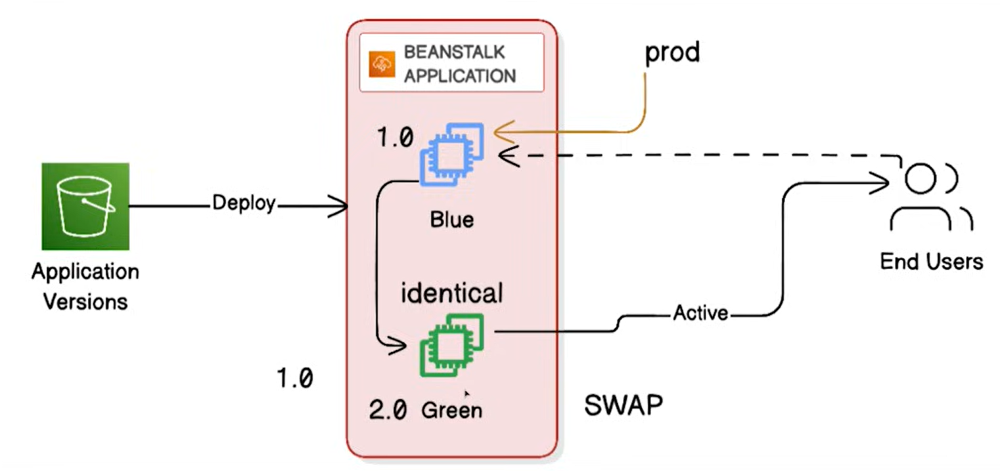
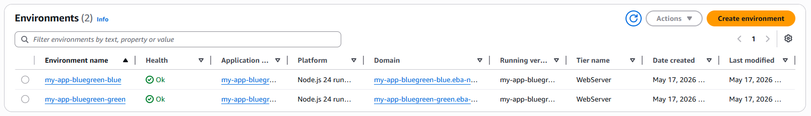
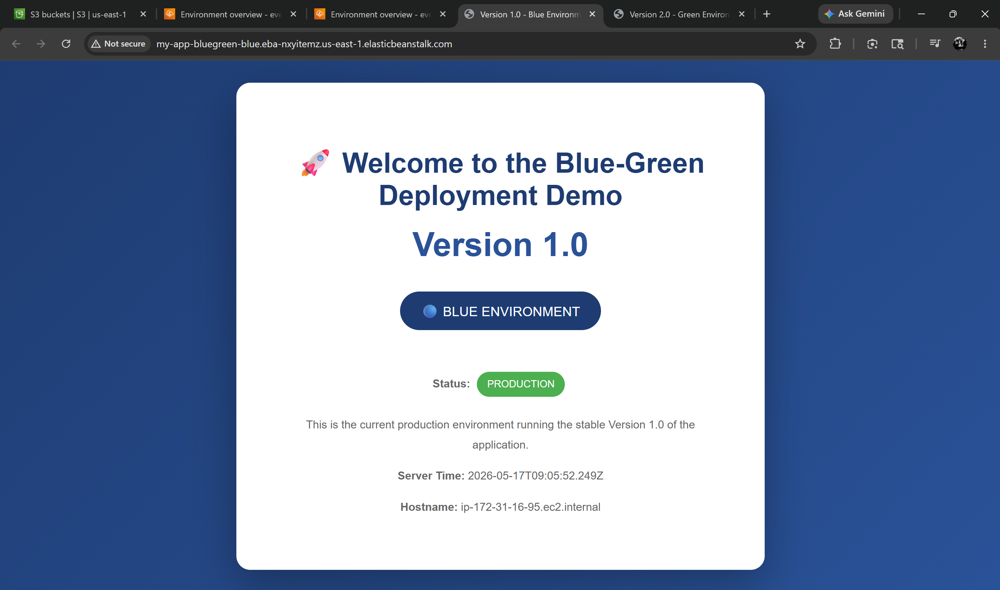
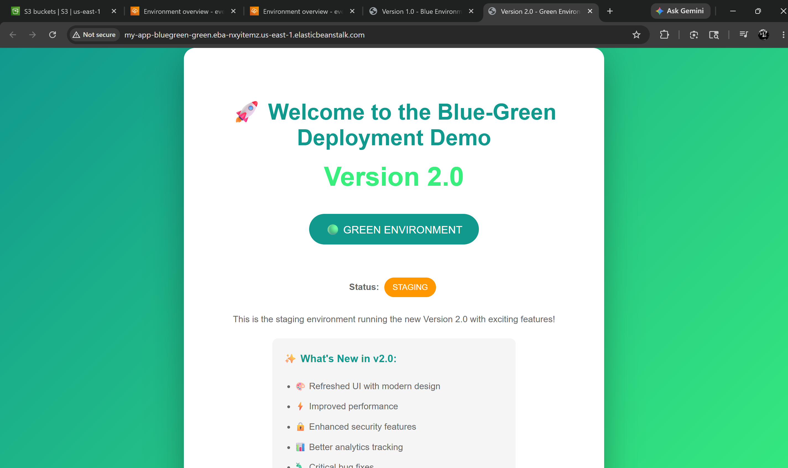
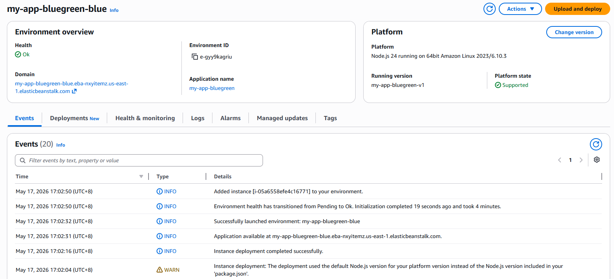
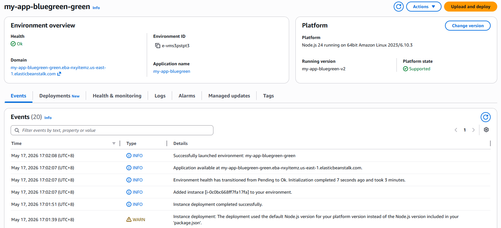
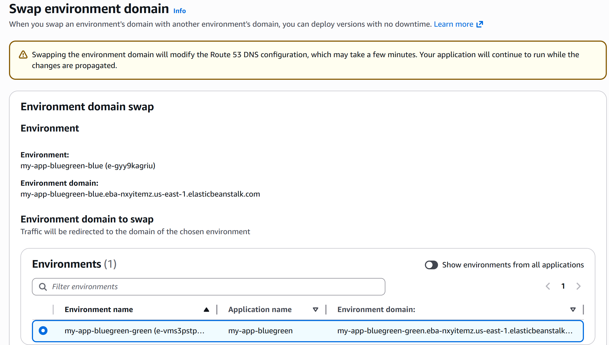
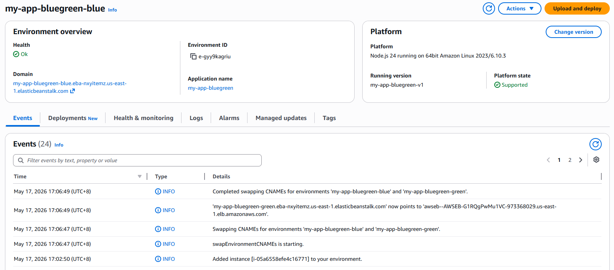
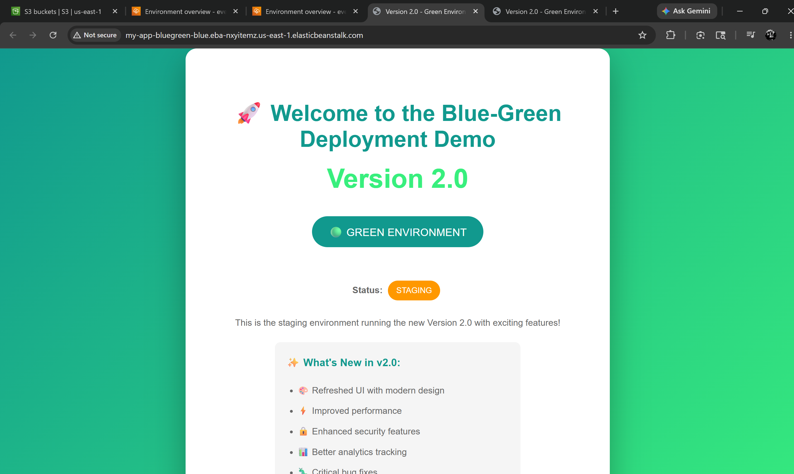
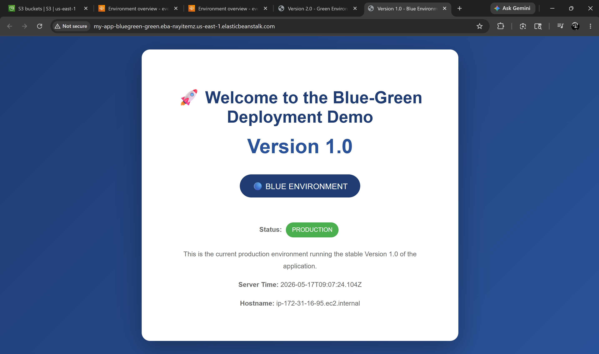

# Blue-Green Deployment with AWS Elastic Beanstalk & Terraform

## 📌 Project Overview

This project demonstrates the use of **Infrastructure as Code (IaC)** to provision and operate a **Blue-Green Deployment** strategy on **AWS Elastic Beanstalk**. Using **Terraform**, two identical environments — Blue (production) and Green (staging) — are stood up simultaneously, each running a different version of a Node.js application. A **CNAME swap** via the AWS CLI is then used to promote the new version to production instantly and with zero downtime, simulating a real-world release pipeline.

**Why Blue-Green Deployment?** In a traditional deployment, pushing a new version directly to production risks downtime and makes rollback painful. Blue-Green deployment solves this by keeping two live environments at all times: the current stable version in Blue (serving real users) and the new version in Green (tested in isolation). When you're confident in Green, a single CNAME swap flips traffic — the switch is near-instant and fully reversible. If anything goes wrong, running the same command again reverts to the previous state.

### Architecture Design


---

## 🏗️ Architecture & Resources

Both environments are structurally identical — same instance type, same platform, same load balancer configuration — differing only in the application version they serve. This parity is essential: it ensures Green accurately represents what will happen when it becomes production.

| # | Resource | Name / Identifier | Purpose |
|---|----------|-------------------|---------|
| 1 | `aws_elastic_beanstalk_application` | `my-app-bluegreen` | Parent Beanstalk application container shared by both environments |
| 2 | `aws_s3_bucket` | `my-app-bluegreen-versions-<account-id>` | Private S3 bucket storing the zipped application bundles for v1 and v2 |
| 3 | `aws_s3_bucket_public_access_block` | `app_versions` | Blocks all public access to the app version bucket |
| 4 | `aws_s3_object` | `app_v1` / `app_v2` | Uploads `app-v1.zip` and `app-v2.zip` with `etag` hashing for change detection |
| 5 | `aws_elastic_beanstalk_application_version` | `my-app-bluegreen-v1` / `my-app-bluegreen-v2` | Registers each zip as a named, deployable application version |
| 6 | `aws_elastic_beanstalk_environment` | `my-app-bluegreen-blue` | Blue environment — serves v1.0 (Production), `t3.micro`, load balanced |
| 7 | `aws_elastic_beanstalk_environment` | `my-app-bluegreen-green` | Green environment — serves v2.0 (Staging), identical configuration |
| 8 | `aws_iam_role` | `my-app-bluegreen-eb-ec2-role` | EC2 instance role with Beanstalk Web Tier, Worker Tier, and Docker policies |
| 9 | `aws_iam_role` | `my-app-bluegreen-eb-service-role` | Beanstalk service role with Enhanced Health and Managed Updates policies |
| 10 | `aws_iam_instance_profile` | `my-app-bluegreen-eb-ec2-profile` | Instance profile binding the EC2 role to Beanstalk-launched instances |

- **Cloud Provider:** AWS (`us-east-1`)
- **Platform:** 64-bit Amazon Linux 2023, Node.js 24 (`v6.10.3`)
- **Instance Type:** `t3.micro` (Auto Scaling: min 1, max 2)
- **Deployment Policy:** Rolling at 50% batch size per environment
- **Health Reporting:** Enhanced

---

## 🔄 How the CNAME Swap Works

Elastic Beanstalk assigns each environment a CNAME — a stable DNS alias that always points to that environment's load balancer. The CNAME swap atomically exchanges these DNS aliases between the two environments. Because the underlying EC2 instances and load balancers never move, neither environment experiences downtime during the swap. Only the DNS pointers flip.

**Before swap:**

| CNAME | Points to | Serving |
|---|---|---|
| `my-app-bluegreen-blue.eba-nxyitemz...` | Blue LB | v1.0 (Production) |
| `my-app-bluegreen-green.eba-nxyitemz...` | Green LB | v2.0 (Staging) |

**After swap:**

| CNAME | Points to | Serving |
|---|---|---|
| `my-app-bluegreen-blue.eba-nxyitemz...` | Green LB | v2.0 (now Production) |
| `my-app-bluegreen-green.eba-nxyitemz...` | Blue LB | v1.0 (now Staging / rollback ready) |

The swap is triggered via this single AWS CLI command:

```bash
aws elasticbeanstalk swap-environment-cnames --source-environment-name my-app-bluegreen-blue --destination-environment-name my-app-bluegreen-green --region us-east-1
```

To **roll back**, simply run the same command again — the CNAMEs swap back instantly.

---

## 🗄️ Remote State (S3 Backend)

Terraform state is stored remotely in an isolated S3 bucket rather than locally. This guarantees a single source of truth for the environment, allowing teams or separate workspaces to compute state changes without risk of local state corruption.

### S3 Backend Bucket Configuration

| Resource | Protection Layer | Purpose |
|----------|-----------------|---------|
| `aws_s3_bucket` | Remotely Managed Storage | Centralises the `terraform.tfstate` registry |
| `aws_s3_bucket_versioning` | Automatic State Snapshotting | Keeps historical revisions for quick rollback |
| `aws_s3_bucket_server_side_encryption_configuration` | Encryption at Rest | AES-256 encryption on all state data |
| `aws_s3_bucket_public_access_block` | Complete Isolation | Blocks all public access to state secrets |

The backend configuration in `terraform.tf`:

```hcl
backend "s3" {
  bucket  = "beanstalk-blue-green-deployment-state-bucket"
  key     = "global/s3/terraform.tfstate"
  region  = "us-east-1"
  encrypt = true
}
```

> ⚠️ **Bootstrap Order (Important)**
> The state bucket is itself managed by Terraform but also used as its backend. On the first run, comment out the `backend "s3"` block and apply with local state to create the bucket. Then uncomment the block and run `terraform init -migrate-state` to migrate your state into it.

---

## 🔧 Manual Deployment Steps

### Prerequisites

- AWS CLI configured with credentials
- Terraform `>= 1.0` installed
- Application bundles pre-packaged (`app-v1.zip`, `app-v2.zip` already included in `app-v1/` and `app-v2/`)

### 1. Clone the Repository

```bash
git clone https://github.com/<your-username>/beanstalk-blue-green-deployment.git
cd beanstalk-blue-green-deployment
```

### 2. Bootstrap the State Bucket (First Run Only)

Comment out the `backend "s3"` block in `terraform.tf`, then target only the state bucket resources:

```bash
terraform init
terraform apply -target=aws_s3_bucket.terraform_state \
                -target=aws_s3_bucket_versioning.enabled \
                -target=aws_s3_bucket_server_side_encryption_configuration.default \
                -target=aws_s3_bucket_public_access_block.public_access
```

### 3. Migrate Local State to S3

Uncomment the `backend "s3"` block and migrate:

```bash
terraform init -migrate-state
```

### 4. Deploy Both Environments

```bash
terraform plan
terraform apply
```

This provisions the Beanstalk application, uploads both app versions to S3, and launches both Blue and Green environments. Each environment takes approximately 3–5 minutes to reach a healthy state.

### 5. Package Application Bundles (if modifying app code)

On Linux/macOS:

```bash
bash package-apps.sh
```

On Windows:

```powershell
.\package-apps.ps1
```

---

## 🔁 Performing the Blue-Green Swap

### Step 1 — Verify Both Environments Before Swap

Navigate to each URL and confirm the expected version is served:

- Blue (Production — v1.0): `http://my-app-bluegreen-blue.eba-nxyitemz.us-east-1.elasticbeanstalk.com`
- Green (Staging — v2.0): `http://my-app-bluegreen-green.eba-nxyitemz.us-east-1.elasticbeanstalk.com`

### Step 2 — Execute the Swap

```bash
aws elasticbeanstalk swap-environment-cnames --source-environment-name my-app-bluegreen-blue --destination-environment-name my-app-bluegreen-green --region us-east-1
```

The swap completes in approximately 1–2 minutes as AWS propagates the DNS change.

### Step 3 — Verify the Swap

Revisit both URLs — the versions should have exchanged:

- Blue URL now serves v2.0 (Green environment promoted to production)
- Green URL now serves v1.0 (Blue environment retained as rollback)

### Step 4 — Rollback (if needed)

Run the same swap command again to revert instantly.

---

## 🔁 CI/CD Pipeline (GitLab)

The `.gitlab-ci.yml` file defines a three-stage pipeline that automates the full Terraform lifecycle, from planning through to optional teardown. The pipeline uses the official `hashicorp/terraform:latest` Docker image. With the S3 backend configured, all three stages read and write to the same remote state file, so `destroy` correctly tears down everything `apply` created.

### Pipeline Stages

| Stage | Job | Trigger | Purpose |
|---|---|---|---|
| `test` | `build_plan` | Automatic | Init, validate, and plan |
| `deploy` | `apply_infrastructure` | Automatic | Apply the Terraform plan |
| `cleanup` | `destroy_infrastructure` | **Manual** | Destroy all resources except the state bucket |

### Stage 1 — Plan (`build_plan`)

Runs automatically on every push. This stage:
- Initialises Terraform and connects to the S3 backend (`terraform init`)
- Validates the configuration syntax (`terraform validate`)
- Generates and saves an execution plan (`terraform plan -out=tfplan`)

The `.terraform/` directory, lock file, and plan file are saved as **artifacts** (valid for 1 week) so subsequent stages don't need to re-download providers or re-compute the plan.

### Stage 2 — Apply (`apply_infrastructure`)

Runs automatically after a successful plan. This stage:
- Restores artifacts from Stage 1 (no `terraform init` needed)
- Applies the saved plan exactly as computed (`terraform apply -auto-approve tfplan`)
- Provisions both Blue and Green Beanstalk environments, uploads the app version zips to S3, and registers both application versions
- Terraform writes the updated state to the remote S3 state bucket automatically

### Stage 3 — Destroy (`destroy_infrastructure`)

Requires a **manual trigger** via the GitLab UI. This stage uses `-target` to destroy only the Beanstalk infrastructure, deliberately leaving the S3 state bucket and its associated resources intact (which would otherwise be blocked by `prevent_destroy = true`):

```yaml
- terraform destroy -auto-approve
    -target="aws_elastic_beanstalk_environment.blue"
    -target="aws_elastic_beanstalk_environment.green"
    -target="aws_elastic_beanstalk_application_version.v1"
    -target="aws_elastic_beanstalk_application_version.v2"
    -target="aws_s3_object.app_v1"
    -target="aws_s3_object.app_v2"
    -target="aws_s3_bucket_public_access_block.app_versions"
    -target="aws_s3_bucket.app_versions"
    -target="aws_elastic_beanstalk_application.app"
    -target="aws_iam_instance_profile.eb_ec2_profile"
    -target="aws_iam_role_policy_attachment.eb_web_tier"
    -target="aws_iam_role_policy_attachment.eb_worker_tier"
    -target="aws_iam_role_policy_attachment.eb_multicontainer_docker"
    -target="aws_iam_role.eb_ec2_role"
    -target="aws_iam_role_policy_attachment.eb_service_health"
    -target="aws_iam_role_policy_attachment.eb_service_managed_updates"
    -target="aws_iam_role.eb_service_role"
```

Terraform resolves dependencies automatically from the targets provided, so resources are torn down in the correct order (e.g. environments before application versions, policy attachments before IAM roles).

### Key Design Decisions

- **Remote state via S3:** Every pipeline job connects to the same S3 backend, so `plan`, `apply`, and `destroy` all operate on the same state. This is what makes the destroy stage correctly tear down what apply created.
- **Artifact passing:** The `.terraform/` provider cache and compiled `tfplan` are passed between stages, avoiding redundant downloads and ensuring the exact same plan is applied that was reviewed.
- **Manual destroy gate:** The `when: manual` directive ensures the Beanstalk environments are never accidentally torn down by an automated trigger.
- **State bucket excluded from destroy:** The S3 state bucket and its versioning, encryption, and access block resources are intentionally omitted from the destroy targets. The `prevent_destroy = true` lifecycle rule provides an additional safeguard.
- **`before_script`:** A global `cd beanstalk-blue-green-deployment` ensures all Terraform commands run in the correct subdirectory regardless of the stage.

---

## 🚀 Deployment Outcome

The `terraform apply` run provisions all resources and outputs the environment URLs and swap instructions needed to operate the deployment.

### Terminal Apply Output

```
application_name           = "my-app-bluegreen"
blue_environment_cname     = "my-app-bluegreen-blue.eba-nxyitemz.us-east-1.elasticbeanstalk.com"
blue_environment_name      = "my-app-bluegreen-blue"
blue_environment_url       = "http://my-app-bluegreen-blue.eba-nxyitemz.us-east-1.elasticbeanstalk.com"
green_environment_cname    = "my-app-bluegreen-green.eba-nxyitemz.us-east-1.elasticbeanstalk.com"
green_environment_name     = "my-app-bluegreen-green"
green_environment_url      = "http://my-app-bluegreen-green.eba-nxyitemz.us-east-1.elasticbeanstalk.com"
s3_bucket                  = "my-app-bluegreen-versions-<account-id>"
```

### Verification Screenshots

Both Elastic Beanstalk environments provisioned and showing `Ok` health status:



S3 buckets created for application versions and Beanstalk internal use:


**Before the swap** — Blue URL serving v1.0 (Production):



**Before the swap** — Green URL serving v2.0 (Staging):



Blue environment detail showing running version `my-app-bluegreen-v1` and health `Ok`:



Green environment detail showing running version `my-app-bluegreen-v2` and health `Ok`:



The AWS Console "Swap environment domain" dialog — selecting the Green environment as the swap target from the Blue environment's Actions menu:



Blue environment event log confirming the CNAME swap completed successfully:



**After the swap** — Blue URL now serving v2.0 (Green promoted to production):



**After the swap** — Green URL now serving v1.0 (Blue retained as rollback):



---

## 🛡️ Security & Design Best Practices

**Environment parity:** Both Blue and Green environments are defined with identical Terraform configurations — same instance type, platform, load balancer type, health check path, and auto-scaling bounds. This guarantees that Green is a faithful representation of what will run in production post-swap, eliminating environment-specific surprises.

**Private application storage:** The S3 bucket holding `app-v1.zip` and `app-v2.zip` has all public access blocked. Beanstalk retrieves bundles using the EC2 instance role, not public URLs.

**etag-based change detection:** Each `aws_s3_object` resource uses `filemd5()` as its `etag`, so Terraform only re-uploads a bundle if its contents have actually changed. This prevents unnecessary redeployments on every `terraform apply`.

**IAM least privilege:** The EC2 instance role carries only the three AWS-managed Beanstalk policies required for web tier operation. The service role carries only Enhanced Health and Managed Updates policies — nothing broader.

**Instant rollback:** Because both environments remain live after a swap, reverting is a single CLI command with no redeployment or infrastructure change required.

---

## 🧹 Cleanup

To safely tear down both Beanstalk environments and associated resources without deleting the remote state bucket, run targeted destructions:

```bash
terraform destroy -auto-approve -target="aws_elastic_beanstalk_environment.blue" -target="aws_elastic_beanstalk_environment.green" -target="aws_elastic_beanstalk_application_version.v1" -target="aws_elastic_beanstalk_application_version.v2" -target="aws_s3_object.app_v1" -target="aws_s3_object.app_v2" -target="aws_s3_bucket_public_access_block.app_versions" -target="aws_s3_bucket.app_versions" -target="aws_elastic_beanstalk_application.app" -target="aws_iam_instance_profile.eb_ec2_profile" -target="aws_iam_role_policy_attachment.eb_web_tier" -target="aws_iam_role_policy_attachment.eb_worker_tier" -target="aws_iam_role_policy_attachment.eb_multicontainer_docker" -target="aws_iam_role.eb_ec2_role" -target="aws_iam_role_policy_attachment.eb_service_health" -target="aws_iam_role_policy_attachment.eb_service_managed_updates" -target="aws_iam_role.eb_service_role"
```

Terraform resolves the dependency graph automatically from the targets provided, so resources are torn down in the correct order (e.g. environments before application versions, attachments before roles). The state bucket, its versioning, encryption configuration, and public access block are intentionally omitted to preserve your state history.