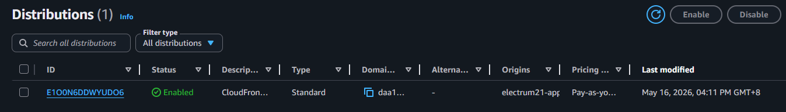
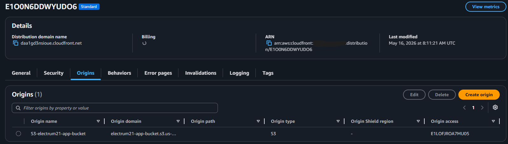
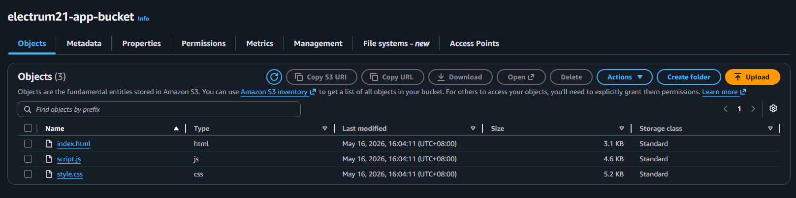
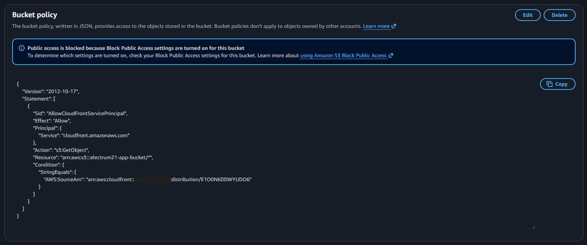
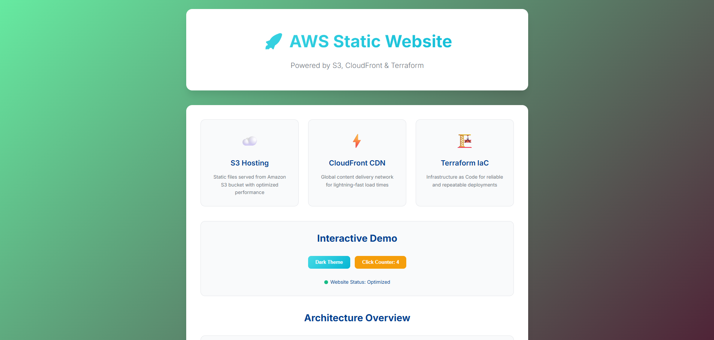

# Secure Static Web App Deployment using CloudFront, S3 & Terraform

## 📌 Project Overview

This project demonstrates the use of **Infrastructure as Code (IaC)** to provision a highly available, secure, and globally distributed static web application on **AWS**. Using **Terraform**, the entire architecture is automated: a frontend web app is hosted in a private S3 bucket, exposed securely to the world via a **CloudFront Content Delivery Network (CDN)** distribution, and shielded using Origin Access Control (OAC).

Remotely managing your state storage via an S3 backend ensures state file consistency and reliability across your development environment without risking local state corruption.

---

## 🏗️ Architecture & Resources

Rather than using public S3 website hosting (which exposes your bucket directly to the public internet), this architecture implements modern cloud security best practices by completely blocking public bucket access and routing all traffic through CloudFront using SigV4 signing.

| # | Resource | Name / Identifier | Purpose |
|---|----------|-------------------|---------|
| 1 | `aws_s3_bucket` | `var.bucket_name` | Private bucket storing the application static assets (`www/`) |
| 2 | `aws_s3_bucket_public_access_block` | `myblock` | Blocks 100% of public ACLs and bucket policies to the hosting bucket |
| 3 | `aws_cloudfront_origin_access_control` | `demo-myoac` | Defines the SigV4 protocol handshake allowing CloudFront to authenticate with S3 |
| 4 | `aws_s3_bucket_policy` | `allow_cloudfront` | Bucket policy granting `s3:GetObject` and `s3:ListBucket` strictly to CloudFront |
| 5 | `aws_s3_object` | `myobject` (Loop) | Dynamically uploads, hashes, and maps content types for all assets in `/www` |
| 6 | `aws_cloudfront_distribution` | `s3_distribution` | Global edge-caching CDN with forced HTTPS redirection |

- **Cloud Provider:** AWS (Region specified via `var.aws_region`)
- **CDN Configuration:** Price Class 100 (Edge locations in US, Canada, and Europe)
- **Security Protocol:** TLS 1.2+ forced via HTTPS redirection
- **Deployment Assets Engine:** Dynamic MIME-type mapper using HCL `lookup()` and file hashing (`filemd5`) for cache invalidation verification

---

## 🗄️ Remote State (S3 Backend)

Terraform state is stored remotely in an isolated S3 bucket rather than locally. This guarantees a single source of truth for the environment, allowing teams or separate workspaces to compute state changes flawlessly.

### S3 Backend Bucket Configuration

The state bucket features built-in protection mechanisms to keep deployment histories safe:

| Resource | Protection Layer | Purpose |
|----------|-----------------|---------|
| `aws_s3_bucket` | Remotely Managed Storage | Centralizes the `terraform.tfstate` binary registry |
| `aws_s3_bucket_versioning` | Automatic State Snapshotting | Keeps historical revisions of your infrastructure for quick rollback points |
| `aws_s3_bucket_server_side_encryption_configuration` | Encryption at Rest | Uses server-side AES-256 encryption to protect sensitive data inside state logs |
| `aws_s3_bucket_public_access_block` | Complete Isolation | Strictly blocks any public eyes from accessing state secrets |

The backend configuration hook within `terraform.tf`:

```hcl
backend "s3" {
  bucket  = "cloudfront-static-web-app-state-bucket"
  key     = "global/s3/terraform.tfstate"
  region  = "eu-central-1" # Set to match your backend deployment region
  encrypt = true
}
```

> ⚠️ **Bootstrap Order (Important)**
> Because the state bucket is managed by Terraform but also used by Terraform as its backend storage vault, you must bootstrap it using local state during the initial run before turning on the S3 backend block.

---

## 🔧 Manual Deployment Steps

> First time deployment only: You must follow the bootstrapping instructions below to prevent a dependency deadlock on the remote state bucket.

### 1. Clone the Codebase & Prepare Assets

Clone the project (the HTML, CSS, JavaScript, and image assets are already inside the `www/` directory in the root folder of this project):

```bash
git clone https://github.com/electrum21/terraform-practice.git
cd cloudfront-s3-static-web
```

### 2. Bootstrap the State Bucket (First Run Only)

Comment out the `backend "s3"` configuration block in your configuration files so Terraform defaults to your local workspace, then target the state resources exclusively:

```bash
terraform init
terraform apply -target=aws_s3_bucket.terraform_state \
                -target=aws_s3_bucket_versioning.enabled \
                -target=aws_s3_bucket_server_side_encryption_configuration.default \
                -target=aws_s3_bucket_public_access_block.public_access
```

### 3. Migrate Your Local State to the Cloud

Uncomment your backend block, and execute an explicit initialization pass to securely migrate your local state history into the newly provisioned AWS state bucket:

```bash
terraform init -migrate-state
```

### 4. Deploy the Global Infrastructure

Run a final plan and execution sequence to spin up the hosting S3 bucket, asset uploader, OAC configurations, and the CloudFront distribution:

```bash
terraform plan
terraform apply
```

### 5. Validation

Once the deployment completes, retrieve the public domain name generated by CloudFront:

```bash
terraform output cloudfront_domain_name
```

Open the returned domain URL (e.g. `https://"daa1gd3nsioue.cloudfront.net"`) in your web browser to confirm your secure static web application is live!

---

## 🚀 Deployment Outcome

The deployment engine effectively coordinates resource creations, establishing secure global routing configurations from a clean run in seconds.


### Verification Screenshots

Below is the confirmation from the AWS Management Console showing the CloudFront Distribution in an `Enabled` state:



Below is the confirmation showing the origin access control for the CloudFront Distribution:



Below is the confirmation showing the S3 bucket containing the HTML, CSS and JS files for the web app:



Below is the confirmation showing the declared policy for the S3 bucket:



Navigating to the CloudFront domain name, the user will be presented with the website as shown:


### Terminal Apply Log Confirmation

```
aws_cloudfront_origin_access_control.myoac: Creating...
aws_s3_bucket.mybucket: Creating...
aws_s3_bucket.mybucket: Creation complete after 3s [id=electrum21-app-bucket]
aws_s3_bucket_public_access_block.myblock: Creating...
aws_s3_object.myobject["index.html"]: Creating...
aws_cloudfront_distribution.s3_distribution: Creating...
aws_cloudfront_distribution.s3_distribution: Still creating... [10s elapsed]
aws_cloudfront_distribution.s3_distribution: Creation complete after 43s [id=E1O0N6DDWYUDO6]
aws_s3_bucket_policy.allow_cloudfront: Creating...
aws_s3_bucket_policy.allow_cloudfront: Creation complete after 2s

Apply complete! Resources: 6 added, 0 changed, 0 destroyed.

Outputs:
cloudfront_domain_name = "daa1gd3nsioue.cloudfront.net"
```

---

## 🛡️ Security Engineering Best Practices

**Zero Public S3 Access:** The asset bucket completely disables standard public endpoints and ACLs. Data is entirely inaccessible to standard HTTP/S3 requests unless signed directly by CloudFront's service identity.

**Implicit Asset Content-Typing:** The code uses dynamic mapping expressions to evaluate asset file extensions natively. This prevents file delivery bugs by ensuring files like `.css` or `.js` are served with proper MIME-types instead of standard binary streams.

**Strict Creation Graph Control:** The bucket policy uses an advanced IAM Policy Document engine that blocks race conditions by ensuring the policy is only written after the target CloudFront Distribution ARN is verified globally by AWS.

---

## 🧹 Cleanup

To safely tear down the provisioned deployment without breaking your underlying state history, run targeted destructions:

```bash
terraform destroy \
  -target=aws_s3_object.myobject \
  -target=aws_s3_bucket_policy.allow_cloudfront \
  -target=aws_cloudfront_distribution.s3_distribution \
  -target=aws_cloudfront_origin_access_control.myoac \
  -target=aws_s3_bucket_public_access_block.myblock \
  -target=aws_s3_bucket.mybucket
```