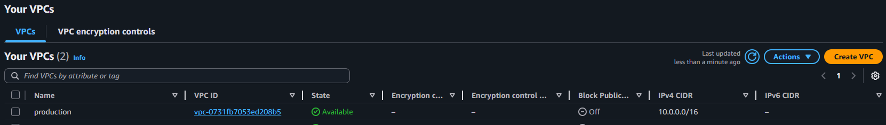
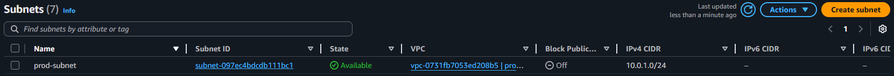
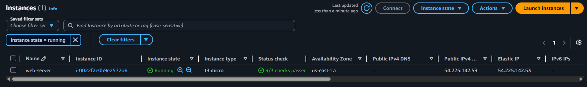

# AWS Simple Web Server Deployment using Terraform

## 📌 Project Overview
This project demonstrates the use of **Infrastructure as Code (IaC)** to provision a fully networked web server on AWS. By using **Terraform**, I've automated the deployment of a complete networking stack and an Apache-powered EC2 instance, with state stored remotely in S3 for reliability.

A **GitLab CI/CD pipeline** is also included to fully automate the Terraform workflow — from validation and planning, through to deployment and teardown — without requiring any manual CLI commands.

---

## 🏗️ Architecture & Resources

The configuration provisions a complete, production-style networking environment from scratch rather than using the default VPC.

| # | Resource | Name | Purpose |
|---|---|---|---|
| 1 | `aws_vpc` | `prod-vpc` | Isolated network (`10.0.0.0/16`) |
| 2 | `aws_internet_gateway` | `gw` | Allows internet traffic in/out of the VPC |
| 3 | `aws_route_table` | `prod-route-table` | Routes all IPv4/IPv6 traffic through the gateway |
| 4 | `aws_subnet` | `subnet-1` | Public subnet (`10.0.1.0/24`) in `us-east-1a` |
| 5 | `aws_route_table_association` | — | Links the subnet to the route table |
| 6 | `aws_security_group` | `allow_web` | Opens ports 22 (SSH), 80 (HTTP), 443 (HTTPS) |
| 7 | `aws_network_interface` | `web-server-nic` | Static private IP (`10.0.1.100`) in the subnet |
| 8 | `aws_eip` | `one` | Elastic (public) IP attached to the NIC |
| 9 | `aws_instance` | `web-server-instance` | Ubuntu 22.04 LTS, `t3.micro`, running Apache2 |

* **Cloud Provider:** AWS (Region: `us-east-1`)
* **Instance Type:** `t3.micro` (Free Tier Eligible)
* **AMI:** Ubuntu Server 22.04 LTS (HVM) — `ami-091138d0f0d41ff90`
* **Web Server:** Apache2, installed and started via `user_data` on boot

---

## 🗄️ Remote State (S3 Backend)

Terraform state is stored remotely in an S3 bucket rather than locally. This is critical for the CI/CD pipeline to work correctly — without it, the `destroy` stage would have no state file to read and would silently do nothing.

### S3 Bucket Configuration

The bucket is defined in `main.tf` and includes three safeguards:

| Resource | Purpose |
|---|---|
| `aws_s3_bucket` | Stores the `terraform.tfstate` file (`simple-web-server-state-bucket`) |
| `aws_s3_bucket_versioning` | Keeps a full revision history of every state file change |
| `aws_s3_bucket_server_side_encryption_configuration` | Encrypts state at rest with AES-256 |
| `aws_s3_bucket_public_access_block` | Blocks all public access to the bucket |

The backend is configured in `terraform.tf`:

```hcl
backend "s3" {
  bucket  = "simple-web-server-state-bucket"
  key     = "global/s3/terraform.tfstate"
  region  = "us-east-1"
  encrypt = true
}
```

### ⚠️ Bootstrap Order (Important)

Because the S3 bucket is managed *by* Terraform but also *used by* Terraform as its backend, there is a specific one-time bootstrapping sequence to follow. See the Manual Deployment Steps section below.

---

## 🔁 CI/CD Pipeline (GitLab)

The `.gitlab-ci.yml` file defines a three-stage pipeline that automates the full Terraform lifecycle. The pipeline uses the official `hashicorp/terraform:latest` Docker image. With the S3 backend configured, all three stages read and write to the same remote state file, so `destroy` correctly tears down everything `apply` created.

### Pipeline Stages

| Stage | Job | Trigger | Purpose |
|---|---|---|---|
| `test` | `build_plan` | Automatic | Init, validate, and plan |
| `deploy` | `apply_infrastructure` | Automatic | Apply the Terraform plan |
| `cleanup` | `destroy_infrastructure` | **Manual** | Destroy all resources |

### Stage 1 — Plan (`build_plan`)

Runs automatically on every push. This stage:
- Initialises Terraform and connects to the S3 backend (`terraform init`)
- Validates the configuration syntax (`terraform validate`)
- Generates and saves an execution plan (`terraform plan -out=tfplan`)

The `.terraform/` directory, lock file, and plan file are saved as **artifacts** (valid for 1 week) so subsequent stages don't need to re-download providers or re-compute the plan.

### Stage 2 — Apply (`apply_infrastructure`)

Runs automatically after a successful plan. This stage:
- Restores artifacts from Stage 1 (no `terraform init` needed)
- Applies the saved plan exactly as computed (`terraform apply -auto-approve tfplan`)
- Terraform writes the updated state to S3 automatically

### Stage 3 — Destroy (`destroy_infrastructure`)

Requires a **manual trigger** via the GitLab UI. This stage uses `-target` to destroy only the web infrastructure, deliberately leaving the S3 state bucket and its associated resources intact (which would otherwise be blocked by `prevent_destroy = true`):

```yaml
- terraform destroy -auto-approve
    -target=aws_instance.web-server-instance
    -target=aws_eip.one
    -target=aws_network_interface.web-server-nic
    -target=aws_security_group.allow_web
    -target=aws_route_table_association.example
    -target=aws_subnet.subnet-1
    -target=aws_route_table.prod-route-table
    -target=aws_internet_gateway.gw
    -target=aws_vpc.prod-vpc
```

Terraform resolves dependencies automatically from the targets provided, so resources are torn down in the correct order (e.g. EIP before NIC, NIC before subnet).

### Key Design Decisions

* **Remote state via S3:** Every pipeline job connects to the same S3 backend, so `plan`, `apply`, and `destroy` all operate on the same state. This is what makes the destroy stage actually work.
* **Artifact passing:** The `.terraform/` provider cache and compiled `tfplan` are passed between stages, avoiding redundant downloads and ensuring the exact same plan is applied that was reviewed.
* **Manual destroy gate:** The `when: manual` directive ensures infrastructure is never accidentally torn down by an automated trigger.
* **`before_script`:** A global `cd simple-web-server` ensures all Terraform commands run in the correct subdirectory regardless of the stage.

---

## 🔧 Manual Deployment Steps

> **First time only:** Follow the bootstrap sequence below because the S3 bucket must exist before Terraform can use it as a backend.

### 1. Clone the Repository

```bash
git clone https://github.com/electrum21/terraform-practice.git
cd simple-web-server
```

### 2. Bootstrap — Create the S3 Bucket (First Time Only)

Comment out the `backend "s3"` block in `terraform.tf` so Terraform uses local state for this first run:

```hcl
terraform {
  # backend "s3" { ... }   <-- comment this out temporarily
}
```

Then initialise and apply **only** the S3 bucket resources:

```bash
terraform init
terraform apply -target=aws_s3_bucket.terraform_state \
                -target=aws_s3_bucket_versioning.enabled \
                -target=aws_s3_bucket_server_side_encryption_configuration.default \
                -target=aws_s3_bucket_public_access_block.public_access
```

### 3. Switch to the Remote Backend

Uncomment the `backend "s3"` block in `terraform.tf`, then reinitialise. Terraform will detect the new backend and offer to migrate your local state to S3:

```bash
terraform init -migrate-state
```

### 4. Deploy the Full Infrastructure

```bash
terraform validate
terraform plan
terraform apply
```

### 5. Verify

After apply completes, the public IP of the instance is printed as an output:

```bash
terraform output instance_public_ip
```

Visit `http://<public-ip>` in a browser — you should see the Apache default page with "My first web server".

---

## 🚀 Deployment Outcome

The infrastructure was successfully initialized and deployed in **17 seconds**.

### Verification Screenshots

Below is the confirmation from the AWS Management Console showing the VPC in an `Available` state:



Below is the confirmation showing the subnet in an `Available` state:



Below is the confirmation showing the instance in a `Running` state:



### Terminal Apply Log

```text
aws_instance.web-server-instance: Creating...
aws_instance.web-server-instance: Still creating... [10s elapsed]
aws_instance.web-server-instance: Creation complete after 17s [id=i-0022f2e0b9e2572b6]

Apply complete! Resources: 1 added, 0 changed, 0 destroyed.
```

---

## 🛡️ Security & Best Practices

* **Sensitive Data Protection:**
  A `.gitignore` file ensures `terraform.tfstate`, `.terraform/`, and `*.tfvars` are never pushed to version control.

* **Credential Management:**
  No AWS Access Keys are hardcoded. Authentication is handled via the AWS CLI and environment-level configuration.

* **Remote State Security:**
  The S3 bucket blocks all public access and encrypts state at rest with AES-256. Versioning is enabled so any accidental state corruption can be rolled back.

* **Lifecycle Protection:**
  The S3 bucket has `prevent_destroy = true` in its lifecycle block, so a `terraform destroy` will refuse to delete the bucket itself — protecting the state history even when tearing everything else down.

* **Manual Destroy Gate:**
  The CI/CD pipeline's destroy stage requires an explicit manual trigger, preventing accidental infrastructure teardown from automated pipeline runs.

---

## 💡 Key Learnings

* **IaC Fundamentals:** Moving away from manual console configuration to declarative, version-controlled infrastructure.

* **Full Networking Stack:** Provisioning a VPC, subnets, route tables, internet gateway, security groups, and NICs from scratch rather than relying on AWS defaults.

* **Remote State Management:** Understanding why local state breaks in CI/CD environments and how an S3 backend solves it by giving every pipeline job a single shared source of truth.

* **Bootstrap Problem:** Recognising the chicken-and-egg dependency when the state backend itself is managed by Terraform, and how to resolve it with a targeted first apply.

* **CI/CD for Infrastructure:** Implementing a pipeline that separates plan, apply, and destroy phases — enforcing review before changes are applied.

---

## 🧹 Cleanup

**Via the GitLab pipeline** (recommended): Trigger the `destroy_infrastructure` job manually from the GitLab UI under the `cleanup` stage. The job uses `-target` to destroy only the web infrastructure, leaving the S3 bucket intact.

**Via the CLI:** Use the same targeted approach to avoid hitting the `prevent_destroy` error on the S3 bucket:

```bash
terraform destroy \
  -target=aws_instance.web-server-instance \
  -target=aws_eip.one \
  -target=aws_network_interface.web-server-nic \
  -target=aws_security_group.allow_web \
  -target=aws_route_table_association.example \
  -target=aws_subnet.subnet-1 \
  -target=aws_route_table.prod-route-table \
  -target=aws_internet_gateway.gw \
  -target=aws_vpc.prod-vpc
```

> **If the S3 bucket needs to be removed:** Remove the `lifecycle { prevent_destroy = true }` block from `main.tf`, run `terraform init -migrate-state` to move state back to local storage, then run a plain `terraform destroy`.