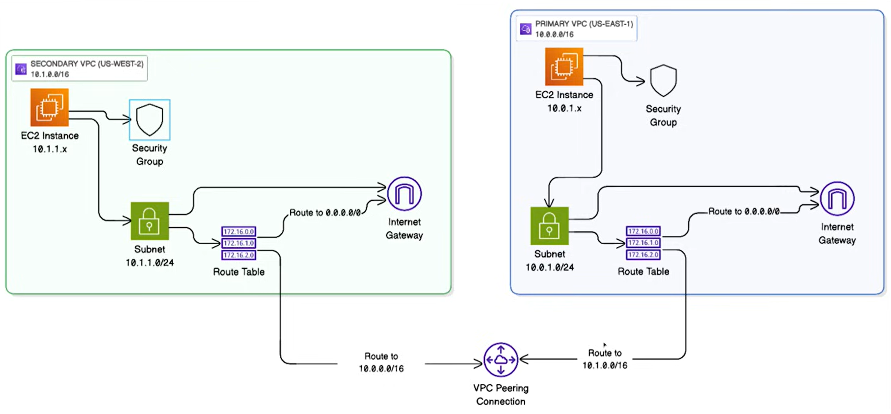
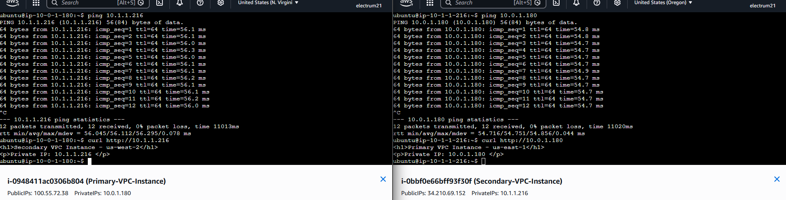
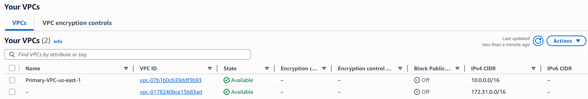
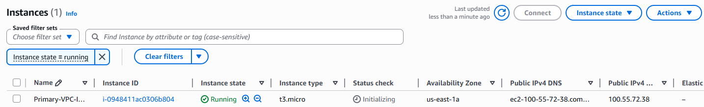
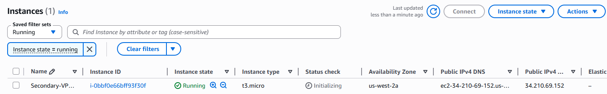
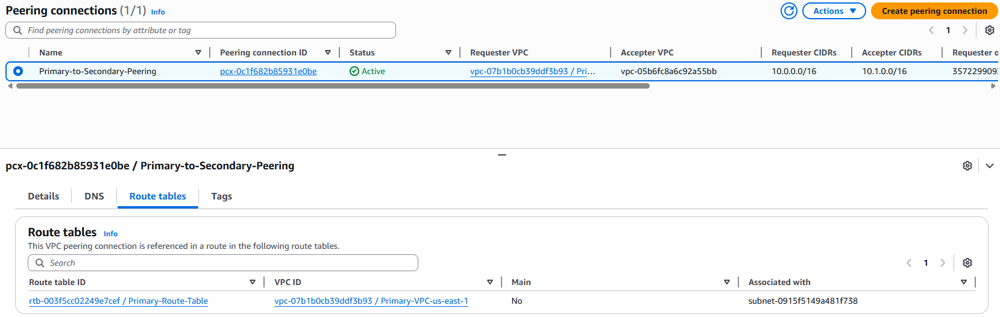

# Cross-Region VPC Peering with EC2 Instances using Terraform

## 📌 Project Overview

This project demonstrates the use of **Infrastructure as Code (IaC)** to provision a secure, cross-region **VPC Peering** connection between two AWS Virtual Private Clouds, each hosting an EC2 instance. Using **Terraform**, the entire architecture is automated: two isolated VPCs — one in `us-east-1` and one in `us-west-2` — are connected via a VPC Peering connection, allowing their EC2 instances to communicate with each other **privately**, entirely within the AWS backbone network.

**Why VPC Peering?** Rather than routing inter-instance traffic through the public internet via an Internet Gateway, VPC Peering keeps all data within AWS's internal network. This ensures secure, low-latency communication between instances as if they were on the same local network — no internet exposure required. The peering connection is also **bidirectional**, meaning both instances can initiate connections to each other using private IPs.

### Architecture Design


---

## 🏗️ Architecture & Resources

Instead of exposing cross-VPC communication over the public internet, this architecture implements AWS networking best practices by routing all inter-VPC traffic through a dedicated VPC Peering connection, with route tables and security groups configured to restrict access only between the two VPC CIDR blocks.

| # | Resource | Name / Identifier | Purpose |
|---|----------|-------------------|---------|
| 1 | `aws_vpc` | `Primary-VPC-us-east-1` | Primary VPC (`10.0.0.0/16`) hosted in `us-east-1` |
| 2 | `aws_vpc` | `Secondary-VPC-us-west-2` | Secondary VPC (`10.1.0.0/16`) hosted in `us-west-2` |
| 3 | `aws_subnet` | `Primary-Subnet-us-east-1` | Public subnet (`10.0.1.0/24`) within the Primary VPC |
| 4 | `aws_subnet` | `Secondary-Subnet-us-west-2` | Public subnet (`10.1.1.0/24`) within the Secondary VPC |
| 5 | `aws_internet_gateway` | `Primary-IGW` / `Secondary-IGW` | Enables SSH access to each EC2 instance from the public internet |
| 6 | `aws_route_table` | `Primary-Route-Table` / `Secondary-Route-Table` | Routes internet traffic via IGW and peered VPC traffic via the peering connection |
| 7 | `aws_vpc_peering_connection` | `Primary-to-Secondary-Peering` | Requester-side peering connection initiated from the Primary VPC |
| 8 | `aws_vpc_peering_connection_accepter` | `Secondary-to-Primary-Peering` | Accepter-side — Secondary VPC automatically accepts the peering request |
| 9 | `aws_route` | `primary_to_secondary` / `secondary_to_primary` | Bidirectional peering routes injected into each VPC's route table |
| 10 | `aws_security_group` | `Primary-VPC-SG` / `Secondary-VPC-SG` | Allows SSH from anywhere and ICMP + TCP traffic from the peer VPC's CIDR only |
| 11 | `aws_instance` | `Primary-VPC-Instance` / `Secondary-VPC-Instance` | Ubuntu `t3.micro` EC2 instances in each VPC for connectivity testing |

- **Cloud Provider:** AWS (Multi-region: `us-east-1` and `us-west-2`)
- **Instance Type:** `t3.micro` (Ubuntu AMI, resolved dynamically via `data.aws_ami`)
- **Peering Type:** Cross-region VPC Peering (inter-region)
- **Security Model:** ICMP and TCP traffic between VPCs restricted to peer CIDR blocks only; SSH open for management

---

## 🔁 How VPC Peering Works

The connection is established using a **requester/accepter** model across two AWS provider aliases:

```hcl
# Requester (Primary VPC initiates)
resource "aws_vpc_peering_connection" "primary_to_secondary" {
  provider    = aws.primary_region
  vpc_id      = aws_vpc.primary_vpc.id
  peer_vpc_id = aws_vpc.secondary_vpc.id
  peer_region = var.secondary_region
  auto_accept = false
}

# Accepter (Secondary VPC accepts automatically)
resource "aws_vpc_peering_connection_accepter" "secondary_accepter" {
  provider                  = aws.secondary_region
  vpc_peering_connection_id = aws_vpc_peering_connection.primary_to_secondary.id
  auto_accept               = true
}
```

Once active, bidirectional routes are injected into each VPC's route table so traffic destined for the peer CIDR is forwarded through the peering connection rather than the Internet Gateway:

```hcl
# Primary VPC: route traffic to Secondary VPC through peering
resource "aws_route" "primary_to_secondary" {
  route_table_id            = aws_route_table.primary_rt.id
  destination_cidr_block    = var.secondary_vpc_cidr   # 10.1.0.0/16
  vpc_peering_connection_id = aws_vpc_peering_connection.primary_to_secondary.id
}

# Secondary VPC: route traffic back to Primary VPC
resource "aws_route" "secondary_to_primary" {
  route_table_id            = aws_route_table.secondary_rt.id
  destination_cidr_block    = var.primary_vpc_cidr      # 10.0.0.0/16
  vpc_peering_connection_id = aws_vpc_peering_connection.primary_to_secondary.id
}
```

---

## 🌐 Role of the Internet Gateway

The Internet Gateways in this architecture serve **one purpose only: enabling SSH access** to the EC2 instances from your local machine for management and testing. They play no role in cross-VPC communication.

| Traffic Type | Path |
|---|---|
| You SSH into an instance | Your machine → IGW → EC2 public IP |
| Instance A pings Instance B | Private IP → Route Table → VPC Peering connection → Private IP |

The peering traffic **never touches the IGW**. This separation is enforced at both the routing and security group level:

- **Route tables** have two distinct rules: `0.0.0.0/0 → IGW` (internet traffic) and `10.x.0.0/16 → pcx-...` (peer traffic). AWS matches the most specific route, so any packet destined for the peer CIDR goes through the peering connection, not the gateway.
- **Security groups** allow ICMP and TCP inbound only from the peer VPC's CIDR block, not from `0.0.0.0/0`, so even if a packet somehow arrived via the internet it would be dropped.

> 💡 If you replaced SSH access with AWS Systems Manager Session Manager, you could remove the IGWs entirely — the VPC Peering connection would continue to function without them.

---

## 🔧 Manual Deployment Steps

### Prerequisites

- AWS CLI configured with credentials
- Terraform `>= 1.2` installed
- Two EC2 Key Pairs created — one in `us-east-1`, one in `us-west-2`

### 1. Clone the Repository

```bash
git clone https://github.com/<your-username>/vpc-peering.git
cd vpc-peering
```

### 2. Configure Variables

Copy the example variables file and fill in your key pair names:

```bash
cp terraform.tfvars.example terraform.tfvars
```

Edit `terraform.tfvars`:

```hcl
primary_region      = "us-east-1"
secondary_region    = "us-west-2"
primary_vpc_cidr    = "10.0.0.0/16"
secondary_vpc_cidr  = "10.1.0.0/16"
primary_key_name    = "your-key-pair-us-east-1"
secondary_key_name  = "your-key-pair-us-west-2"
instance_type       = "t3.micro"
```

### 3. Initialise Terraform

```bash
terraform init
```

### 4. Deploy the Infrastructure

```bash
terraform plan
terraform apply
```

### 5. Validation

Once deployment completes, Terraform will output connection details:

```bash
terraform output
```

Use the `test_connectivity_command` output to SSH in and verify cross-VPC reachability (see the [Connectivity Testing](#-connectivity-testing) section below).

---

## ✅ Connectivity Testing

After deployment, verify that the VPC Peering connection is working using the private IPs of each instance — no public internet involved.

**From the Primary Instance (us-east-1) → ping Secondary (us-west-2):**

```bash
ssh -i your-key-east.pem ubuntu@100.55.72.38
ping 10.1.1.216
```

**From the Secondary Instance (us-west-2) → ping Primary (us-east-1):**

```bash
ssh -i your-key-west.pem ubuntu@34.210.69.152
ping 10.0.1.180
```

The screenshot below confirms successful bidirectional connectivity — 0% packet loss and consistent ~55ms latency across regions via the peering connection:



The `curl` output further confirms each instance's HTTP server responds correctly using the peer's **private IP** only.

---

## 🚀 Deployment Outcome

The `terraform apply` run provisions all resources and outputs the IDs and IPs needed to verify and connect to each instance.

### Terminal Apply Output

```
primary_instance_id              = "i-0948411ac0306b804"
primary_instance_private_ip      = "10.0.1.180"
primary_instance_public_ip       = "100.55.72.38"
primary_vpc_cidr                 = "10.0.0.0/16"
primary_vpc_id                   = "vpc-07b1b0cb39ddf3b93"
secondary_instance_id            = "i-0bbf0e66bff93f30f"
secondary_instance_private_ip    = "10.1.1.216"
secondary_instance_public_ip     = "34.210.69.152"
secondary_vpc_cidr               = "10.1.0.0/16"
secondary_vpc_id                 = "vpc-05b6fc8a6c92a55bb"
vpc_peering_connection_id        = "pcx-0c1f682b85931e0be"
vpc_peering_status               = "active"
```

### Verification Screenshots

**Primary VPC (`us-east-1`) confirmed Available in the AWS Console:**



**Secondary VPC (`us-west-2`) confirmed Available in the AWS Console:**


**Primary EC2 Instance running in `us-east-1a`:**



**Secondary EC2 Instance running in `us-west-2`:**



**VPC Peering Connection (`pcx-0c1f682b85931e0be`) in Active state, with route tables confirmed on the Primary side:**



**Peering connection confirmed on the Secondary side as well:**


---

## 🛡️ Security Design

**Private-only inter-VPC traffic:** Security groups on both instances restrict ICMP and TCP inbound traffic to the peer VPC's CIDR block only. No cross-VPC traffic is routed through the Internet Gateway.

**Bidirectional route injection:** Both route tables have explicit peer routes added via `aws_route`, ensuring traffic in either direction flows through the peering connection and not the public internet.

**`depends_on` ordering:** EC2 instances depend on `aws_vpc_peering_connection_accepter` to ensure the peering connection is fully established before any instance traffic is attempted.

**Dual-provider alias pattern:** Terraform's `alias` provider pattern allows a single configuration file to manage resources across two AWS regions simultaneously without requiring separate workspaces or state files.

---

## 🗄️ Remote State (S3 Backend) — Optional

The `terraform.tf` file includes a commented-out S3 backend block for teams who want to store state remotely:

```hcl
backend "s3" {
  bucket  = "vpc-peering-state-bucket"
  key     = "global/s3/terraform.tfstate"
  region  = "us-east-1"
  encrypt = true
}
```

> ⚠️ **Bootstrap Order:** Because the state bucket is itself a Terraform resource, you must run an initial local-state apply to create it before enabling the S3 backend. Once created, uncomment the backend block and run `terraform init -migrate-state` to migrate.

---

## 🧹 Cleanup

To safely tear down all provisioned infrastructure without touching the remote state bucket and its associated resources, run targeted destructions:

```bash
terraform destroy -auto-approve -target="aws_instance.primary_instance" -target="aws_instance.secondary_instance" -target="aws_security_group.primary_sg" -target="aws_security_group.secondary_sg" -target="aws_route.primary_to_secondary" -target="aws_route.secondary_to_primary" -target="aws_vpc_peering_connection_accepter.secondary_accepter" -target="aws_vpc_peering_connection.primary_to_secondary" -target="aws_route_table_association.primary_rta" -target="aws_route_table_association.secondary_rta" -target="aws_route_table.primary_rt" -target="aws_route_table.secondary_rt" -target="aws_internet_gateway.primary_igw" -target="aws_internet_gateway.secondary_igw" -target="aws_subnet.primary_subnet" -target="aws_subnet.secondary_subnet" -target="aws_vpc.primary_vpc" -target="aws_vpc.secondary_vpc"
```

Terraform resolves the dependency graph automatically from the targets provided, so resources are torn down in the correct order (e.g. instances before security groups, peering connection before VPCs). The state bucket, its versioning, encryption configuration, and public access block are intentionally omitted to preserve your state history.